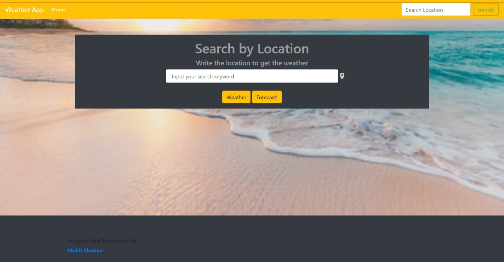
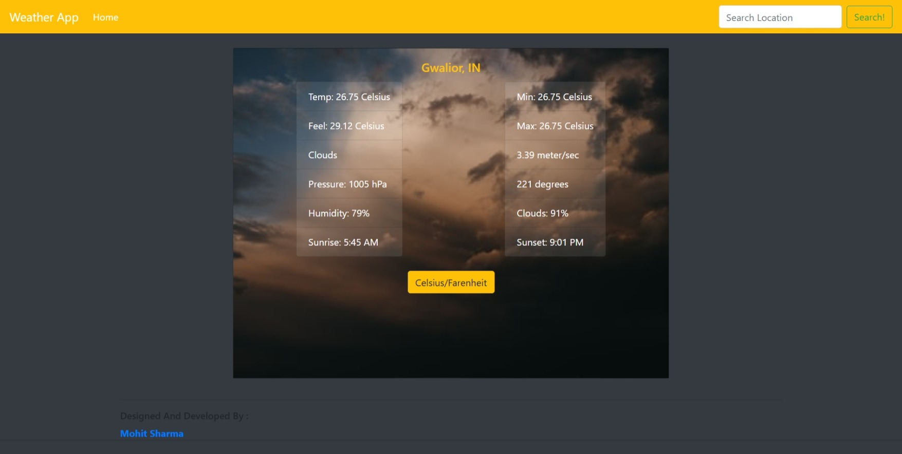
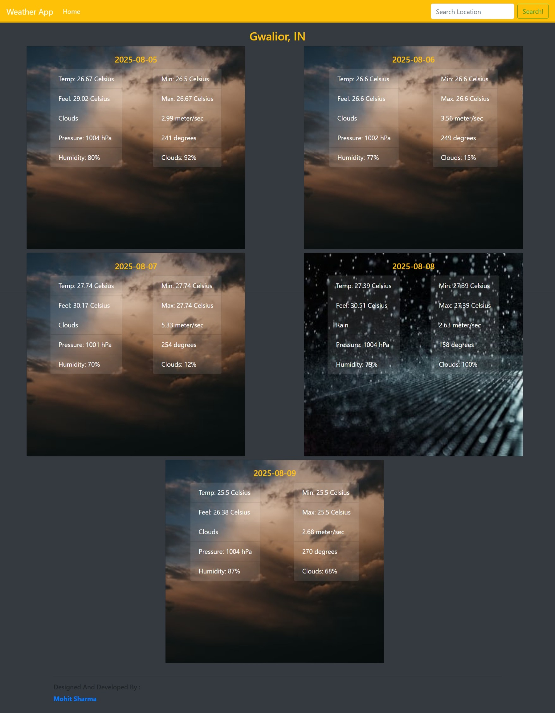

div align="center">

# 🌤️ Weather Forecasting App

### _Real-time weather data for any city, anywhere in the world._

[](https://msparadox.github.io/Weather-Forecasting-App/)
[](https://github.com/MsParadox/Weather-Forecasting-App)
[](LICENSE)
[](https://developer.mozilla.org/en-US/docs/Web/JavaScript)
[](https://openweathermap.org/api)

</div>

---

## 🧩 Project Overview

> **Weather Forecasting App** is a responsive web application that displays real-time weather data for any location worldwide using the **OpenWeatherMap API**. Users can search for any city and instantly view current conditions and a 5-day forecast — with seamless **°C / °F** unit conversion at a click.

- 🌡️ Live temperature readings with min/max range
- 💨 Wind speed, cloud cover, rain probability & humidity
- 📅 5-day extended forecast for better trip planning
- 🔄 Instant Celsius ↔ Fahrenheit toggle

---

## 🖼️ Screenshots

<p align="center"><b>Landing Page</b></p>
<p align="center">
  
</p>

<p align="center"><b>Current Weather</b></p>
<p align="center">
  
</p>

<p align="center"><b>5-Day Forecast</b></p>
<p align="center">
  
</p>

---

## ✨ Features

| Feature | Details |
|---|---|
| 🔍 **City Search** | Search real-time weather for any city worldwide |
| 🌡️ **Temperature** | Current, min & max temperature display |
| 💧 **Humidity** | Live humidity percentage |
| 💨 **Wind Speed** | Current wind speed readings |
| ☁️ **Cloud Cover** | Cloud percentage and rain possibility |
| 🔄 **Unit Toggle** | Switch between Celsius and Fahrenheit instantly |
| 📅 **5-Day Forecast** | Extended forecast for better planning |
| 📱 **Responsive Design** | Works seamlessly across all devices |

---

## 🛠️ Tech Stack

| Technology | Purpose |
|---|---|
| **HTML5** | Markup & structure |
| **CSS3** | Styling & responsive layout |
| **JavaScript (ES6+)** | Core logic & API integration |
| **Bootstrap** | UI components & responsiveness |
| **NPM** | Package management |
| **Webpack** | Module bundling |
| **OpenWeatherMap API** | Real-time weather data |
| **GitHub Actions** | CI/CD pipeline |

---

## 🚀 Getting Started

### Option 1 — Use the Live App

👉 Visit **[msparadox.github.io/Weather-Forecasting-App](https://msparadox.github.io/Weather-Forecasting-App/)** and start searching!

---

### Option 2 — Run Locally

#### Prerequisites
- A modern, up-to-date browser 💪
- **Node.js** & **npm** installed
- A free **OpenWeatherMap API key** → [Get one here](https://openweathermap.org/api)

#### Installation

```bash
# 1. Clone the repository
git clone https://github.com/MsParadox/Weather-Forecasting-App.git

# 2. Navigate into the project folder
cd Weather-Forecasting-App

# 3. Install dependencies
npm install

# 4. Add your API key
#    Create a .env file or update the config file with your OpenWeatherMap API key
echo "API_KEY=your_openweathermap_api_key_here" > .env

# 5. Build and start the app
npm start
```

Then open [http://localhost:8080](http://localhost:8080) in your browser. 🎉

---

## 🔮 Future Features

- [ ] Hourly forecast breakdown
- [ ] Geolocation-based auto-detection
- [ ] Weather alerts and notifications
- [ ] Dark / Light theme toggle
- [ ] Favourite cities list
- [ ] Interactive weather maps

---

## 👨‍💻 Author

<div align="center">

### Mohit Sharma

_Full Stack Developer · Problem Solver · Open Source Enthusiast_

[](https://www.linkedin.com/in/mohit-sharma-27a6532b6)
[](https://github.com/MsParadox)
[](https://codeforces.com/profile/Msparadox)
[](https://leetcode.com/u/ms_paradox78/)
[](mailto:mohitsharma782828372@gmail.com)

</div>

---

## 🤝 Contributing

Contributions, issues, and feature requests are always welcome!

1. Fork the repository
2. Create your feature branch: `git checkout -b feature/amazing-feature`
3. Commit your changes: `git commit -m 'Add some amazing feature'`
4. Push to the branch: `git push origin feature/amazing-feature`
5. Open a Pull Request

---

## 📄 License

This project is licensed under the [MIT License](LICENSE).

---

<div align="center">

⭐ **Found this project useful? Drop a star — it means a lot!** ⭐

</div>
